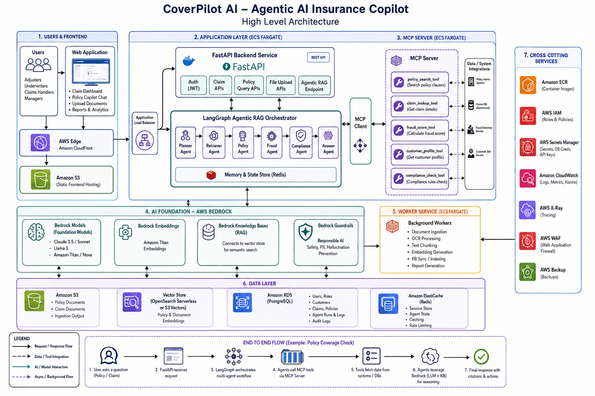

# Claims Pilot Agent

Agentic RAG workflow service for insurance coverage analysis. Makes use of AWS Bedrock, LangGraph-style workflows, and communicates with the MCP server for tool execution.

## Architecture



This service is the LangGraph / agentic RAG orchestrator and MCP client in the diagram: it runs the multi-agent workflow, calls AWS Bedrock for reasoning, and invokes the MCP server for policy, claim, and fraud tools.

## Coverage-check Workflow

```
POST /api/v1/workflow/coverage-check
  -> Planner Agent (plans next steps)
  -> Policy Agent (search clauses via MCP server)
  -> Fraud Agent (calculate fraud score via MCP server)
  -> Answer Agent (compose final response)
```

## Local Development

```bash
pip install -e ".[dev]"            # core + DSPy
# optional: policy PDF/DOCX parsing
pip install -e ".[dev,docling]"
make run        # AI service on port 9020
make test       # Run tests
make lint       # Run linter
```

Requires `claim-pilot-mcp-server` running on port 8001.

## Configuration

Copy `env.example` to `.env`:

```
ENVIRONMENT=dev
AWS_REGION=us-east-1
BEDROCK_MODEL_ID=anthropic.claude-3-5-sonnet-20240620-v1:0
MCP_SERVER_URL=http://localhost:8001
```

### Docling (policy document parsing)

When `DOCLING_ENABLED=true`, the policy agent parses `policy_document_path` (PDF/DOCX on the **AI service filesystem**) with [Docling](https://github.com/docling-project/docling) and prepends the markdown excerpt to MCP-retrieved clauses. Truncate length is controlled by `DOCLING_MAX_CHARS`.

### DSPy (coverage reasoning on Bedrock)

When `DSPY_BEDROCK_ENABLED=true`, the answer agent runs a **DSPy** `ChainOfThought` program over the merged policy evidence and fraud context using **Amazon Bedrock** (via LiteLLM). Set AWS credentials with `bedrock:InvokeModel` on the configured model. If the call fails, the service falls back to keyword heuristics.

The API accepts optional `policy_document_path` on `POST /api/v1/workflow/coverage-check` (use with Docling).

## LiteLLM

Production dependency **`litellm`** is pinned alongside DSPy. Use ```claim_pilot_ai.llm.litellm_client``` for direct ``chat_completion`` calls (Bedrock via ``bedrock/{BEDROCK_MODEL_ID}``). Override with env ``LITELLM_MODEL_ID``.

## Ragas + DeepEval (offline / CI)

Install eval extras and run scripts (requires AWS Bedrock credentials by default):

```bash
make install-eval
make eval-ragas      # Ragas: ContextRecall, Faithfulness, FactualCorrectness
make eval-deepeval   # DeepEval: Faithfulness + Answer Relevancy per golden row
```

Golden rows live in ``eval/golden_samples.jsonl``. Override judge model with ``EVAL_LLM_MODEL=bedrock/...``.

Optional pytest (calls Bedrock when enabled):

```bash
RUN_EVAL_TESTS=1 pytest tests/eval/ -v -m eval
```

## Docker

Private `git+https` dependencies need a PAT as a build-arg (see `Makefile` / `.env`).

```bash
docker build --build-arg GITHUB_TOKEN="$GITHUB_TOKEN" -t claim-pilot-ai .
docker run -p 9020:9020 --env-file .env claim-pilot-ai
```

## Versioning

Calendar Versioning (CalVer): `YYYY.MM.PATCH`

## Maintainer

**Martins Ajibade**   

This repository is maintained for the **Claim Pilot** platform.

- **Email:** [martinsajibade3@gmail.com]

For professional inquiries, security-sensitive reports, or questions about this component, please reach out via the address above.